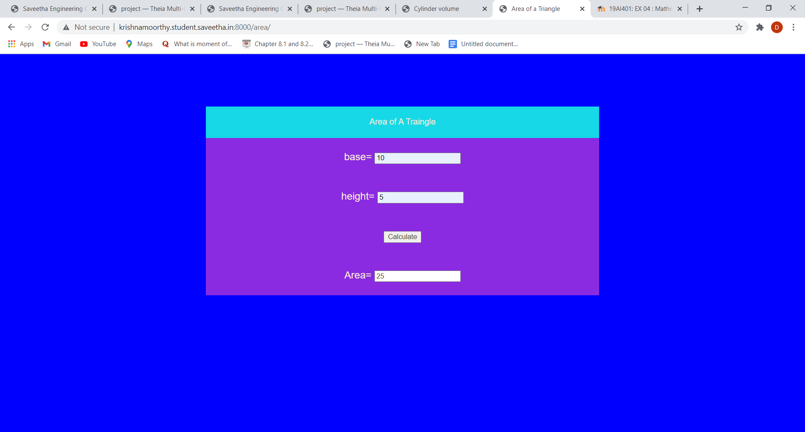
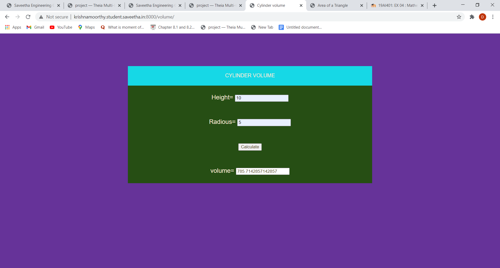
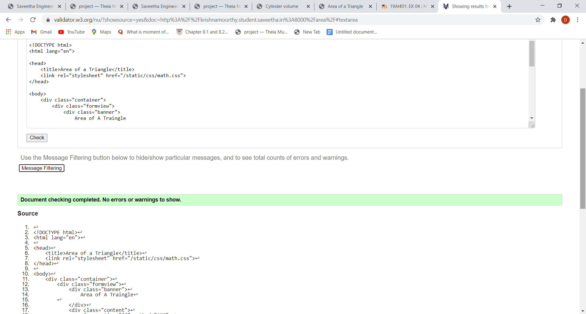
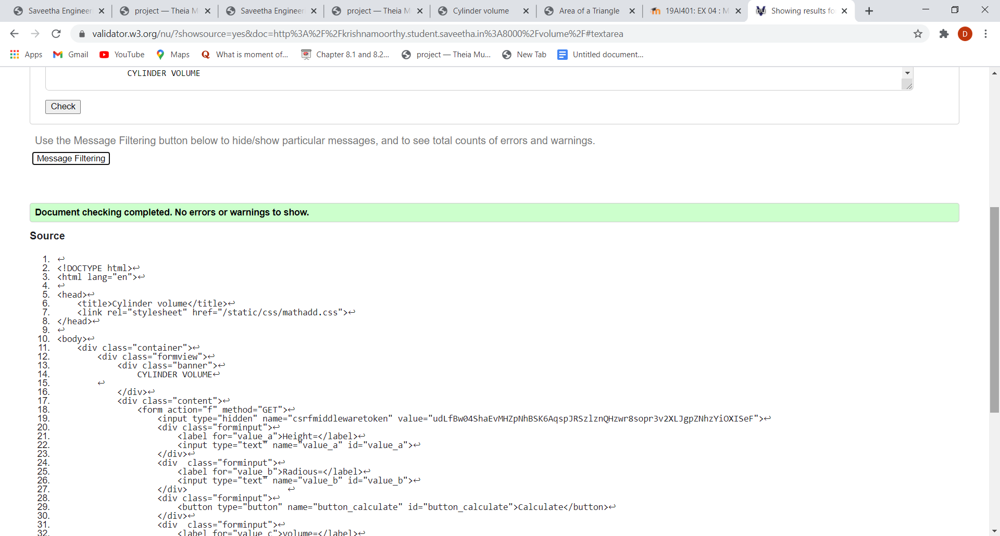

# Mathematical Calculations using JavaScript
## AIM:
To design a website to calculate the area of a traingle and volume of a cylinder using JavaScript.

## DESIGN STEPS:
### Step 1: 
Requirement collection.
### Step 2:
Creating the layout using HTML and CSS.
### Step 3:
Write JavaScript to perform calculations.
### Step 4:
Choose the appropriate style and color scheme.
### Step 5:
Validate the layout in various browsers.
### Step 6:
Validate the HTML code.
### Step 6:
Publish the website in the given URL.


## PROGRAM:
### mathadd.html
```

<!DOCTYPE html>
<html>

<head>
    <title>Cylinder volume</title>
    <link rel="stylesheet" href="">
</head>

<body>
    <div class="container">
        <div class="formview">
            <div class="banner">
                CYLINDER VOLUME
        
            </div>
            <div class="content">
                <form action="" method="GET">
                    
                    <div class="forminput">
                        <label for="value_a">Height=</label>
                        <input type="text" name="value_a" id="value_a">
                    </div>
                    <div  class="forminput">
                        <label for="value_b">Radious=</label>
                        <input type="text" name="value_b" id="value_b">
                    </div>                    
                    <div class="forminput">
                        <button type="button" name="button_calculate" id="button_calculate">Calculate</button>
                    </div>
                    <div  class="forminput">
                        <label for="value_c">volume=</label>
                        <input type="text" name="value_c" id="value_c" readonly>
                    </div> 
                    
                    
                </form>
            </div>
        </div>
    </div>
    <script src="/static/js/mathscript.js"></script>
</body>

</html>
```

### traingle.html
```

<!DOCTYPE html>
<html>

<head>
    <title>Area of a Triangle</title>
    <link rel="stylesheet" href="">
</head>

<body>
    <div class="container">
        <div class="formview">
            <div class="banner">
                Area of A Traingle
        
            </div>
            <div class="content">
                <form action="" method="GET">
                    
                    <div class="forminput">
                        <label for="value_a">base=</label>
                        <input type="text" name="value_a" id="value_a">
                    </div>
                    <div  class="forminput">
                        <label for="value_b">height=</label>
                        <input type="text" name="value_b" id="value_b">
                    </div>                    
                    <div class="forminput">
                        <button type="button" name="button_value" id="button_value">Calculate</button>
                    </div>
                    <div  class="forminput">
                        <label for="value_c">Area=</label>
                        <input type="text" name="value_c" id="value_c" readonly>
                    </div> 
                    
                    
                </form>
            </div>
        </div>
    </div>
    <script src="/static/js/math.js"></script>
</body>

</html>
```


## OUTPUT:





## CODE VALIDATION REPORT:





## RESULT:
Thus a website is designed for the Area of a traingle and is hosted in the URL http://krishnamoorthy.student.saveetha.in:8000/area/ HTML code is validated.
Thus a website is designed for the volume of a cylinder and is hosted in the URL http://krishnamoorthy.student.saveetha.in:8000/volume/ HTML code is validated.